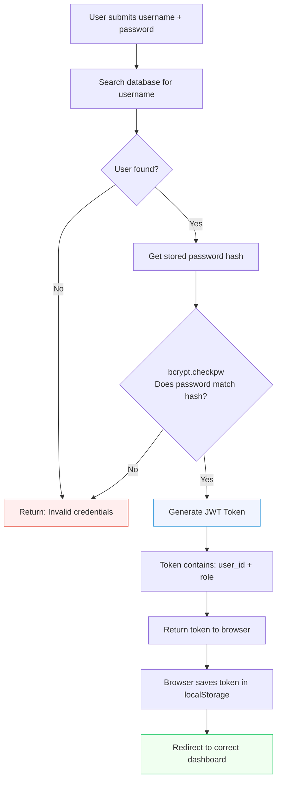
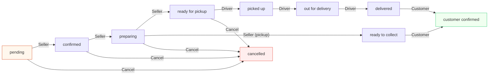

# Hi Te! — Algorithms, Models & System Logic

> [!NOTE]
> Your system does NOT use AI/machine learning. It uses **rule-based algorithms** — which means the logic follows clear, step-by-step rules written in code. This is the standard for web applications. Below are all the algorithms and design patterns your system uses.

---

## 1. Authentication Algorithm (Login)

### What it does
Verifies that the user is who they claim to be, and gives them a secure "pass" (JWT token) to use the system.

### Why it matters
Without this, anyone could pretend to be anyone — a customer could access the admin panel, or someone could view other people's orders.

### Technologies used
- **bcrypt** — A one-way hashing algorithm for passwords
- **JWT (JSON Web Token)** — A digital "ID card" token

### How the algorithm works (step by step)

```
ALGORITHM: User Login

INPUT: username, password
OUTPUT: JWT token + user data (or error)

1. Receive username and password from the frontend
2. Search the database for a user with that username
3. IF no user found:
     → Return error "Invalid username or password"
     → STOP

4. Take the stored password_hash from the database
5. Use bcrypt to CHECK if the entered password matches the hash
   (bcrypt.checkpw compares them WITHOUT ever decrypting the hash)
6. IF password does NOT match:
     → Return error "Invalid username or password"
     → STOP

7. Password matches! Generate a JWT token containing:
     - user ID (who they are)
     - role (what they can do: customer/seller/driver/admin)
     - expiry time (24 hours)

8. Return the JWT token + user info to the frontend
9. Frontend saves the token in localStorage
10. Redirect user to their role-specific dashboard
```

### Flowchart



### How to explain it:
> *"We use bcrypt for password security. When a user registers, their password is hashed — meaning it's converted into a random-looking string that can never be reversed back to the original password. When they log in, bcrypt compares the entered password against the stored hash without ever decrypting it. If it matches, we generate a JWT token — a digitally signed ID card — that the browser stores and shows with every future request. This way, the user doesn't need to send their password again for every action."*

### Why bcrypt instead of plain text?

| Method | How password is stored | Security |
|---|---|---|
| Plain text | `mypassword123` | Anyone who sees the database knows all passwords |
| MD5/SHA | `482c811da5d5b4bc` | Can be cracked with rainbow tables |
| **bcrypt** | `$2b$12$LJ3m4hs...` | Salted + slow = extremely hard to crack |

---

## 2. Order Processing Algorithm (State Machine)

### What it does
Controls how an order moves through different stages — from "just placed" to "delivered." Each stage has strict rules about what can happen next.

### Why it matters
Without this, a driver could mark an order as "delivered" before even picking it up, or a seller could skip steps.

### The algorithm pattern: Finite State Machine
A **state machine** means an order can only be in ONE state at a time, and can only move to specific NEXT states. It's like a train track — you can only go forward to the next station, never skip one.

### State transitions (Delivery Order)

```
ALGORITHM: Order State Machine (Delivery)

STATES: pending → confirmed → preparing → ready_for_pickup →
        picked_up → out_for_delivery → delivered → customer_confirmed

RULES:
  - pending          → confirmed         (by: Seller)
  - confirmed        → preparing         (by: Seller)
  - preparing        → ready_for_pickup  (by: Seller)
  - ready_for_pickup → picked_up         (by: Driver)
  - picked_up        → out_for_delivery  (by: Driver)
  - out_for_delivery  → delivered         (by: Driver)
  - delivered        → customer_confirmed (by: Customer)

  ANY STATE → cancelled (by: Seller or Admin)

VALIDATION:
  Before each transition, the system checks:
  1. Is the user authorized for this action? (role check)
  2. Is the new status a valid NEXT state? (sequence check)
  3. If both pass → update status + notify everyone
  4. If either fails → return 403 Forbidden error
```

### State transitions (Pickup Order)

```
STATES: pending → confirmed → preparing → ready_to_collect → customer_confirmed

(No driver involved — customer picks up the food themselves)
```

### Flowchart



### How to explain it:
> *"Our order system follows a finite state machine pattern. An order can only be in one status at a time, and can only move forward to the next valid status. For example, a driver can't mark an order as delivered if it hasn't been picked up first. The backend validates every status change to ensure the correct sequence is followed and that the user has the right role to make that change."*

---

## 3. Role-Based Access Control (RBAC)

### What it does
Controls **who can do what**. Each user has a role, and each role has specific permissions. You can't access features that aren't meant for your role.

### Why it matters
Without this, a customer could delete other people's products, or a driver could access admin analytics.

### The algorithm

```
ALGORITHM: Role-Based Access Control

INPUT: JWT token from request header
OUTPUT: Allow or Deny (403 Forbidden)

1. Extract JWT token from the request's "Authorization" header
2. Decode the token to get user_id and role
3. Check: Does this role have permission for this endpoint?

PERMISSION TABLE:
  /api/products/mine      → only "seller"
  /api/orders/incoming     → only "seller"
  /api/orders/my-orders    → only "customer"
  /api/admin/*             → only "admin"
  /api/driver/*            → only "driver"
  /api/orders/ (POST)      → only "customer"

4. IF role matches → Allow the request
5. IF role doesn't match → Return 403 Forbidden
```

### How to explain it:
> *"We implement role-based access control using JWT tokens. Every API endpoint checks the user's role before processing the request. For example, the /api/admin/stats endpoint first verifies that the JWT token contains role='admin'. If a customer tries to access it, they get a 403 Forbidden error. This ensures data isolation between roles."*

---

## 4. Real-Time Broadcasting Algorithm (Observer Pattern)

### What it does
When ANY user performs an action, ALL other users are notified instantly — without refreshing their page.

### Why it matters
For the demo, this is the "wow factor." When you place an order as a customer, the seller's screen updates in real-time!

### The algorithm pattern: Observer Pattern + Server-Sent Events

```
ALGORITHM: Real-Time Broadcasting

COMPONENTS:
  - _clients: a set of message queues (one per connected browser)
  - broadcast(): sends a message to ALL queues
  - /events: SSE endpoint that streams messages from queue to browser

WHEN A BROWSER OPENS A DASHBOARD:
  1. Browser creates an EventSource connection to /api/realtime/events
  2. Server creates a new Queue for this browser
  3. Server adds Queue to _clients set
  4. Server keeps the connection OPEN (streaming)

WHEN ANY USER PERFORMS AN ACTION:
  1. Backend route calls broadcast("order_updated", {order_id: 5, status: "confirmed"})
  2. broadcast() loops through ALL _clients
  3. For each client queue, it pushes the message
  4. The SSE stream sends the message to the browser
  5. Browser's sync.js receives it
  6. sync.js checks: "Is this notification relevant to MY role?"
  7. If yes → show toast, update badge, refresh data
  8. If no → ignore silently

WHEN A BROWSER DISCONNECTS:
  1. Server removes their Queue from _clients
  2. No more messages sent to that browser
```

### How to explain it:
> *"We use the Observer design pattern implemented through Server-Sent Events. Every open browser tab maintains a persistent connection to the server. When any action happens — like an order being placed — the server pushes an event to all connected clients simultaneously. Each client then filters the event based on their role and updates their UI accordingly. This gives us real-time multi-user synchronization without WebSockets or polling."*

---

## 5. Inventory Management Algorithm

### What it does
Automatically **deducts product quantities** when an order is placed, and **prevents overselling** if stock runs out.

### The algorithm

```
ALGORITHM: Stock Deduction on Order Placement

INPUT: list of items [{product_id, quantity}, ...]

FOR EACH item in the order:
  1. Find the product in the database
  2. CHECK: Is product.quantity >= requested quantity?
     - IF NO → Return error "Not enough stock for [product name]"
     - IF YES → Continue
  3. product.quantity = product.quantity - requested quantity
  4. IF product.quantity == 0:
       → Set product.is_available = False (marks it as "Sold Out")

5. Save all changes to database
6. Create the order with all items
```

### How to explain it:
> *"When a customer places an order, the system first validates that all requested items have sufficient stock. If any item is out of stock, the order is rejected. Otherwise, quantities are deducted atomically — meaning either all items are deducted or none are, preventing partial orders. When a product reaches zero quantity, it's automatically marked as unavailable on the menu."*

---

## 6. Revenue Analytics Algorithm

### What it does
Calculates total revenue, monthly trends, and top-selling products for the admin dashboard.

### The algorithm

```
ALGORITHM: Revenue Calculation

TOTAL REVENUE:
  SELECT SUM(total_amount)
  FROM orders
  WHERE status IN ('delivered', 'customer_confirmed')
  → Only counts completed orders (not cancelled or pending)

MONTHLY REVENUE:
  GROUP orders BY month
  For each month, SUM the total_amount
  → Creates data points for the revenue chart

TOP PRODUCTS:
  JOIN order_items WITH products
  GROUP BY product_id
  For each product:
    - total_sold = SUM(quantity)
    - total_revenue = SUM(quantity × price_at_order)
  ORDER BY total_sold DESC
  LIMIT 5
  → Returns the 5 best-selling products
```

### How to explain it:
> *"The admin analytics use SQL aggregation functions through SQLAlchemy ORM. Revenue is calculated by summing the total_amount of all delivered orders. Monthly trends are generated by grouping orders by month and computing the sum for each period. Top products are determined by joining order_items with products and ranking by total units sold."*

---

## 7. OOP Model Design (4 Pillars)

### What it does
Your entire data layer (models.py) follows Object-Oriented Programming principles.

### The 4 Pillars in your system

| Pillar | How it's used in your system |
|---|---|
| **Abstraction** | You call `User.query.filter_by(username='john')` instead of writing raw SQL. SQLAlchemy **hides the complexity** of database queries behind simple Python methods. |
| **Encapsulation** | Each model (User, Product, Order) keeps its own data (columns) and behavior (`to_dict()` method) together in one class. You access `user.username`, never the raw database row. |
| **Inheritance** | Every model class inherits from `db.Model`, which gives it database powers — like `.query`, `.save()`, `.delete()` — without you writing that code yourself. |
| **Polymorphism** | Every model has a `to_dict()` method, but each one returns **different data**. `User.to_dict()` returns username/email, while `Order.to_dict()` returns items/total. Same method name, different behavior. |

### How to explain it:
> *"Our data models demonstrate the four pillars of OOP. We use Abstraction through SQLAlchemy ORM, which lets us interact with the database using Python objects instead of raw SQL. Encapsulation bundles each entity's data and methods into a single class. Inheritance from db.Model gives every model built-in database operations. And Polymorphism is shown through the to_dict() method — each model implements it differently to serialize its unique set of attributes."*

---

## Summary Table — All Algorithms at a Glance

| # | Algorithm / Pattern | Technology | Purpose |
|---|---|---|---|
| 1 | **Password Hashing** | bcrypt | Securely store and verify passwords |
| 2 | **Token Authentication** | JWT | Stateless user sessions |
| 3 | **State Machine** | Custom logic | Control order lifecycle |
| 4 | **Role-Based Access** | JWT claims | Restrict features by role |
| 5 | **Observer Pattern** | Server-Sent Events | Real-time notifications |
| 6 | **Stock Deduction** | SQLAlchemy transactions | Prevent overselling |
| 7 | **SQL Aggregation** | SQLAlchemy queries | Revenue & analytics |
| 8 | **OOP (4 Pillars)** | Python classes + db.Model | Clean data architecture |
